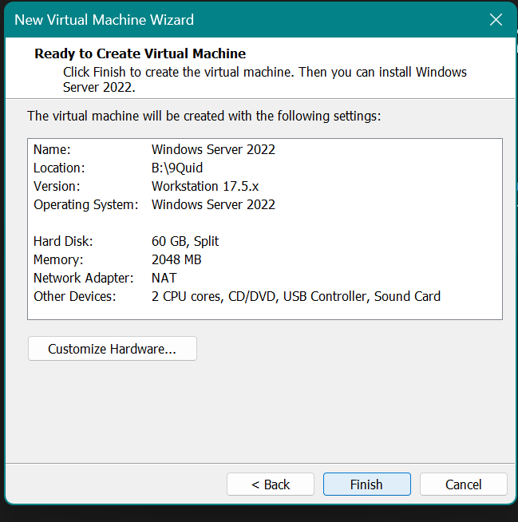
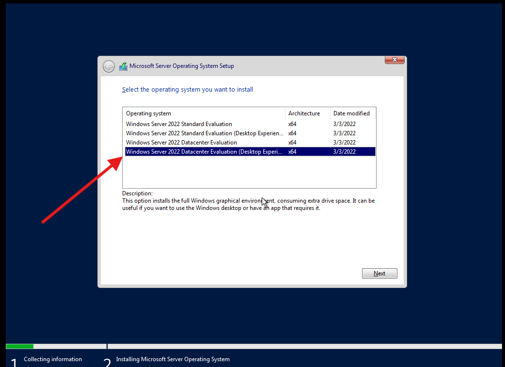
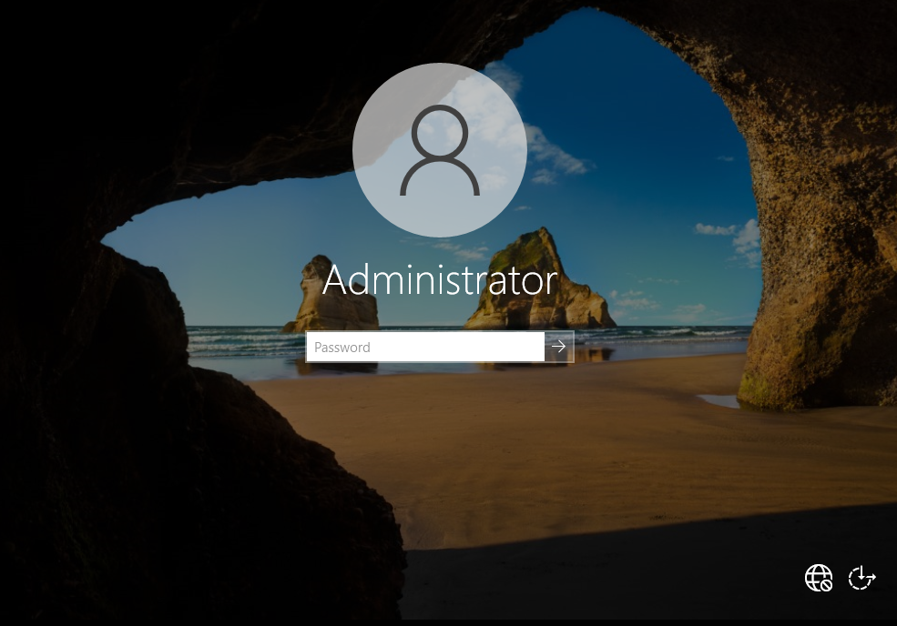
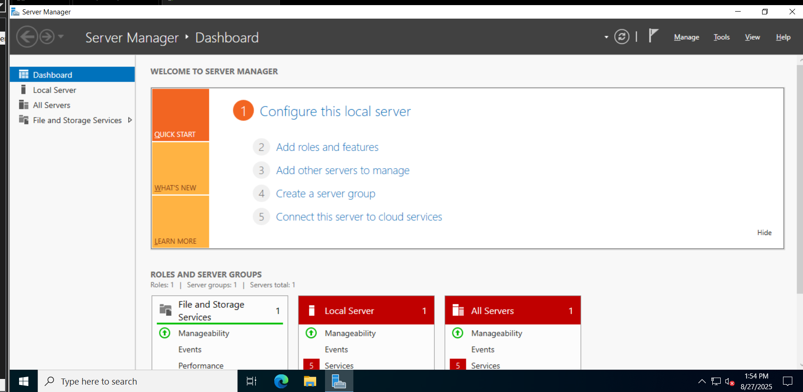

# 1. Windows Server 2022 Set-up

## Objectives

- Install Windows Server 2022 on VMware.
- Configure initial server settings (hostname, NIC, IP, updates).
- Verify network connectivity and readiness for AD DS deployment.

## Steps and Walkthroughs

### Step 1 - Installed Windows Server 2022

Firstly, I deployed windows server on VMware Workstation Pro and allocated **2 GB RAM**, **2 CPUs**, and **60 GB disk**.

**Figure 01:** Shows Resources allocated to Windows Server.

Next, I installed Server 2022 Datacenter with Desktop Experience.

**Figure 02:** Windows Server 2022 installation with Desktop Experience selected.

Then confirmed the set-up was complete.

**Figure 03:** Shows the first login page

**Figure 04:** windows server dashboard respectively.

### Step 2 - Configure Network Interface

- Set static IP: **192.168.1.9**
- Subnet mask: **255.255.255.0**
- Default Gateway: **192.168.1.1**
- Preferred DNS: **192.168.1.9**

 
**Figure 05:** NIC properties showing assigned static IP, subnet mask, gateway, and DNS and IP configuration respectively.

Confirmed configurations were applied by running ipconfig command.

**Figure 06:** Network Configurations

### Step 3 – Rename Server & Join Domain Preparation

Here, I renamed the server: 9QUID-SERVER.

**Figure 07:** Shows a new name for the Windows Server

- Verified network connectivity by pinging the DNS server and the loopback address.

**Figure 08:** Successfull ping to the loopback & DNS.

## Key Settings, Commands & Troubleshooting Notes

### Key Settings

- create a custom NAT if using VMware to ensure internet access after assigning a static ip address.
- Rename your server and assign a static ip address before promoting it to a domain controller.
- Take regular snapshots so you can easily rollback in case of system crashes or failures.

## Useful Commands

### Check IP cconfiguration

- ipconfig /all

### Test DNS resolution

- ping 192.168.1.9

### Check loopback

- ping 127.0.0.1

### Restart after updates

- Restart-Computer -Force

## Troubleshooting Example

### Issue:

- I lost internet connection after assigning a static IP on the default NAT network.

### Resolution:
- I created a custom NAT network in VMware Workstation, then reconfigured the server’s NIC to use this new network. Internet access was restored while maintaining static IP addressing for the domain.

### Lessons Learned

- VMware’s Easy Install prompts for a license key — skip ISO selection during VM creation to avoid this.

- Taking regular snapshots will save you a lot of time if something breaks during your set up.

- Using a custom NAT gives you control over addressing and avoids internet loss when static IPs are used.
